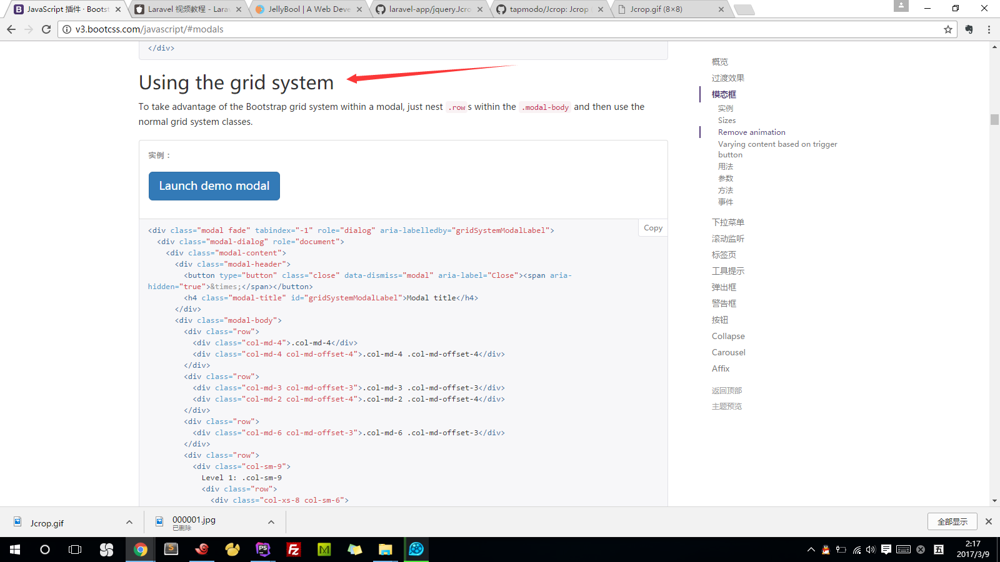

#使用Jcrop来实现头像裁剪

Jcrop头像裁剪插件：[https://github.com/tapmodo/Jcrop](https://github.com/tapmodo/Jcrop) 
或者
[https://github.com/JellyBool/laravel-app/blob/master/jquery.Jcrop.css](https://github.com/JellyBool/laravel-app/blob/master/jquery.Jcrop.css)  
[https://github.com/JellyBool/laravel-app/blob/master/jquery.Jcrop.min.js](https://github.com/JellyBool/laravel-app/blob/master/jquery.Jcrop.min.js)  


改进后的模态框：
[https://github.com/JellyBool/laravel-app/blob/master/crop.blade.php](https://github.com/JellyBool/laravel-app/blob/master/crop.blade.php)  

views/users/avatar.blade.php
```
@extends('app')
@section('content')
    <div class="container">
        <div class="row">
            <div class="col-md-6 col-md-offset-3">
                <div class="text-center">
                    <div id="validation-errors"></div>
                    avatar}}" width="120" class="img-circle" id="user-avatar" alt="">
                    {!! Form::open(['url'=>'/avatar','files'=>true,'id'=>'avatar']) !!}
                    <div class="text-center">
                        <button type="button" class="btn btn-success avatar-button" id="upload-avatar">上传新的头像</button>
                    </div>
                    {!! Form::file('avatar',['class'=>'avatar','id'=>'image']) !!}
                    {!! Form::close() !!}
                    <div class="span5">
                        <div id="output" style="display:none">
                        </div>
                    </div>
                </div>
            </div>
        </div>
<div class="modal fade" id="exampleModal" tabindex="-1" role="dialog" aria-labelledby="exampleModalLabel">
    <div class="modal-dialog" role="document">
        <div class="modal-content">
            {!! Form::open( [ 'url' => ['/crop/api'], 'method' => 'POST', 'onsubmit'=>'return checkCoords();','files' => true ] ) !!}
            <div class="modal-header">
                <button type="button" class="close" data-dismiss="modal" aria-label="Close"><span aria-hidden="true" style="color: #ffffff">&times;</span></button>
                <h4 class="modal-title" id="exampleModalLabel">裁剪头像</h4>
            </div>
            <div class="modal-body">
                <div class="content">
                    <div class="crop-image-wrapper">
                        
                        <input type="hidden" id="photo" name="photo" />
                        <input type="hidden" id="x" name="x" />
                        <input type="hidden" id="y" name="y" />
                        <input type="hidden" id="w" name="w" />
                        <input type="hidden" id="h" name="h" />
                    </div>
                </div>

            </div>
            <div class="modal-footer">
                <button type="button" class="btn btn-default" data-dismiss="modal">取消</button>
                <button type="submit" class="btn btn-primary">裁剪头像</button>
            </div>
            {!! Form::close() !!}
        </div>
    </div>
</div>
    </div>
@stop

@section('script')
    <script>
        $(document).ready(function() {
            var options = {
                beforeSubmit:  showRequest,
                success:       showResponse,
                dataType: 'json'
            };
            $('#image').on('change', function(){
                $('#upload-avatar').html('正在上传...');
                $('#avatar').ajaxForm(options).submit();
            });

            function showRequest() {
                $("#validation-errors").hide().empty();
                $("#output").css('display','none');
                return true;
            }

            function showResponse(response)  {
                if(response.success == false)
                {
                    var responseErrors = response.errors;
                    $.each(responseErrors, function(index, value)
                    {
                        if (value.length != 0)
                        {
                            $("#validation-errors").append('<div class="alert alert-error"><strong>'+ value +'</strong><div>');
                        }
                    });
                    $("#validation-errors").show();
                } else {
                    var cropBox = $("#cropbox");
                    cropBox.attr('src',response.avatar);
                    $('#photo').val(response.avatar);
                    $('#upload-avatar').html('更换新头像');
                    $('#exampleModal').modal('show');
                    cropBox.Jcrop({
                        aspectRatio: 1,
                        onSelect: updateCoords,
                        setSelect: [120,120,10,10]
                    });
                    $('.jcrop-holder img').attr('src',response.avatar);
                }

                function updateCoords(c)
                {
                    $('#x').val(c.x);
                    $('#y').val(c.y);
                    $('#w').val(c.w);
                    $('#h').val(c.h);
                }

                function checkCoords()
                {
                    if (parseInt($('#w').val())) return true;
                    alert('请选择图片.');
                    return false;
                }
            }
        });
    </script>
@stop
```
代码片断：[https://github.com/JellyBool/laravel-app/blob/master/crop.js](https://github.com/JellyBool/laravel-app/blob/master/crop.js)  

web.php
```
route::post('/crop/api', 'UsersController@cropAvatar');
```

UsersController.php
```
/**
 * Jcrop裁剪
 * @param Request $request
 * @return \Illuminate\Http\RedirectResponse|\Illuminate\Routing\Redirector
 */
public function cropAvatar(Request $request){
    $photo = mb_substr($request->get('photo'), 1);
    $width = (int) $request->get('w');
    $height = (int) $request->get('h');
    $xAlign = (int) $request->get('x');
    $yAlign = (int) $request->get('y');

    Image::make($photo)->crop($width, $height, $xAlign, $yAlign)->save();

    $user = \Auth::user();
    $user->avatar = $request->get('photo');
    $user->save();

    return redirect('/user/avatar');
}
```