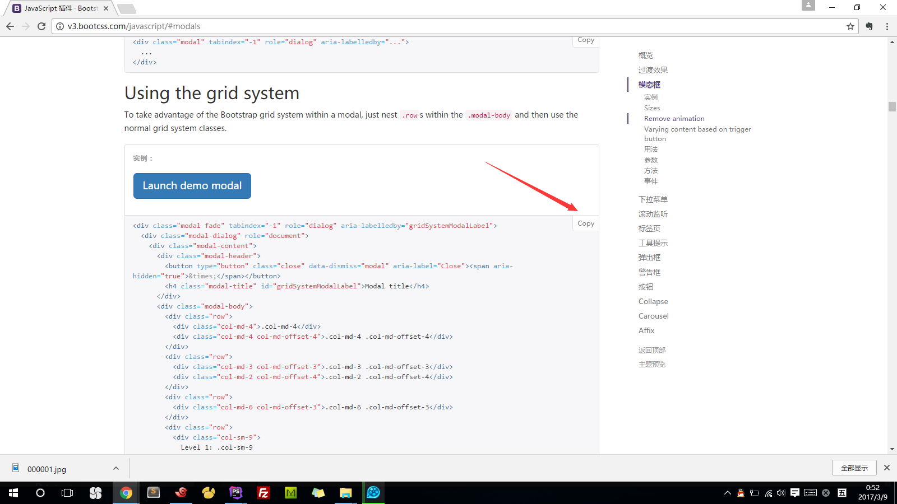

#使用Jcrop来实现头像裁剪

Jcrop头像裁剪插件：[https://github.com/tapmodo/Jcrop](https://github.com/tapmodo/Jcrop) 
或者
[https://github.com/JellyBool/laravel-app/blob/master/jquery.Jcrop.css](https://github.com/JellyBool/laravel-app/blob/master/jquery.Jcrop.css)  
[https://github.com/JellyBool/laravel-app/blob/master/jquery.Jcrop.min.js](https://github.com/JellyBool/laravel-app/blob/master/jquery.Jcrop.min.js)




web.php
```
route::post('/crop/api', 'UsersController@cropAvatar');
```
