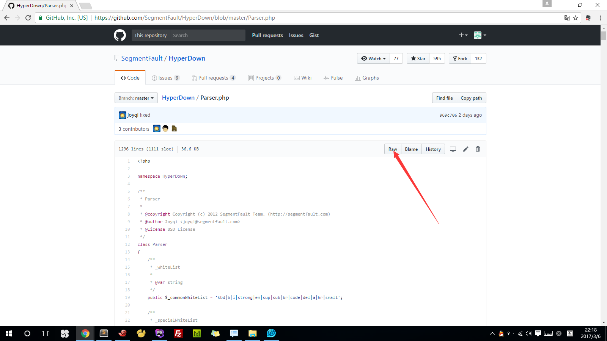

#Markdown和引入第三方库

SegmentFault/HyperDown：[https://github.com/SegmentFault/HyperDown](https://github.com/SegmentFault/HyperDown)  

Parser.php：[https://github.com/SegmentFault/HyperDown/blob/master/Parser.php](https://github.com/SegmentFault/HyperDown/blob/master/Parser.php)  



app/Markdown/Parser.php

app/Markdown/Markdown.php
```
<?php
/**
 * Created by PhpStorm.
 * User: zhulinjie
 * Date: 2017/3/6
 * Time: 21:45
 */

namespace App\Markdown;


class Markdown
{
    protected $parser;

    /**
     * Markdown constructor.
     * @param $parser
     */
    public function __construct(Parser $parser)
    {
        $this->parser = $parser;
    }

    /**
     * @param $text
     * @return string
     */
    public function markdown($text){
        $html = $this->parser->makeHtml($text);
        return $html;
    }
}
```

composer dump-autoload

PostsController.php
```
use App\Markdown\Markdown;

protected $markdown;

/**
 * PostsController constructor.
 */
public function __construct(Markdown $markdown)
{
    $this->middleware('auth', ['only' => ['create', 'store', 'edit', 'update']]);
    $this->markdown = $markdown;
}

/**
 * @param $id
 * @return \Illuminate\Contracts\View\Factory|\Illuminate\View\View
 */
public function show($id){
    $discussion = Discussion::findOrFail($id);
    $html = $this->markdown->markdown($discussion->body);
    return view('forum.show', compact('discussion', 'html'));
}
```

